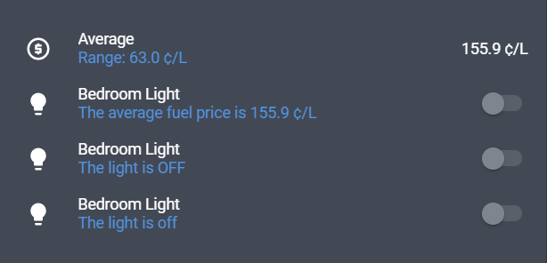
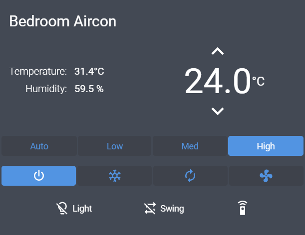

# 🐤 Canary

[](https://github.com/custom-components/hacs)

Canary adds many useful extensions to lovelace, such as [templating secondary info](#secondary-info), [stacking in-card](#in_card), and [more](#usage)!

## Aim

Similar to Chrome Canary, the idea behind this card is to implement features that don't make drastic changes to lovelace but add support for features that (by mine and popular opinion) would make (mostly) good additions to core Lovelace.

Of course this is a custom card with no affiliation to the Home Assistant team so no guarantee any of these features will make it into Home Assistant. Really this is just a collection of useful features implemented in a way that tries to be as native as possible.

## Usage

Much like [card-mod] Canary extends the default lovelace cards, so you don't need to actually define a `canary-card` for these options to work. The options are added to their respective cards as 'extensions'.

Available Extensions:
  - [Generic Entity Rows](#generic-entity-rows)
    - [`secondary_info`](#secondary_info)
    - [`hide_warning`](#hide_warning)
  - [Vertical Stack Card](#vertical-stack-card)
    - [`in_card`](#in_card)
  - [Generic Cards](#generic-cards)
    - [`no_card`](#no_card)
  - [Glance Card](#glance-card)
    - [`align`](#align)
  - [Canary Card](#canary-card)

### Generic Entity Rows

#### `secondary_info`

All entity-rows that support `secondary_info` now have the ability for it to be templated, this is similar to how [secondaryinfo-entity-row] works, but with more options for templating and some efficiency improvements.

There are three ways to template this, you can use a [secondary info object](#secondary-info-object), [Thomas Lovén's templates][mod-plugin-templates] or Jinja2 templates.

##### Secondary Info Object

| Name        | Type     | Description                                                                       |
| ----------- | -------- | --------------------------------------------------------------------------------- |
| `entity`    | `string` | Optional: entity to extract data from, defaults to the rows configured entity.    |
| `attribute` | `object` | Optional: extract an attribute from the entity, otherwise the state will be used. |
| `prefix`    | `string` | Optional: string to append **before** the attribute/state.                        |
| `postfix`   | `string` | Optional: string to append **after** the attribute/state.                         |

##### Jinja Templates
_Note: that Jinja2 templates are slightly slower to load initially due to latency, as they are rendered in the backend, whereas the other two methods are rendered in the front end._

Jinja templates have access to a few special variables. Those are:

- `config` - an object containing the entity row configuration.
- `entity` - the entity_id from the current entity row configuration. This **must** be used instead of `config.entity` for the template to automatically update.
- `user` - the username of the currently logged in user.
- `browser` - the deviceID of the current browser (see [browser_mod](https://github.com/thomasloven/hass-browser_mod)).
- `hash` - the hash part of the current URL.

##### Example



```yaml
type: entities
entities:
  # EXAMPLE: Secondary Info Object.
  # This is the most efficient way to template secondary info, but the least flexible.

  - entity: sensor.fuel_price_average
    name: Average
    secondary_info:
      attribute: Range
      prefix: "Range: "
      postfix: " ¢/L"

  - entity: light.bedroom_light
    secondary_info:
      entity: sensor.fuel_price_average # override the default row entity.
      prefix: "The average fuel price is "
      postfix: " ¢/L"

  # EXAMPLE: Jinja Templates.
  # These templates have access to the rows configured entity as the variable `entity`.

  - entity: light.bedroom_light
    secondary_info: "The light is {{ states(entity) | upper }}"

  # EXAMPLE: Thomas Lovén's Templates.
  # These templates can access the rows configured entity using `{entity}`.

  - entity: light.bedroom_light
    secondary_info: "The light is [[ {entity}.state ]]"


    # Both Jinja and Thomas Lovén's templates support the use of `entity_ids` to specify which entities to monitor, 
    # this is only useful for templates that don't have an entity, e.g. `{{ now() }}`.
    entity_ids:
      - light.bedroom_light
```

---

#### `hide_warning`

All entity rows now have access to the **`hide_warning`** option, when set to true it will hide the row if it shows a warning, e.g. if the configured entity is missing.

---

### Vertical Stack Card

#### `in_card`

All `vertical-stack` cards now have access to the **`in_card`** option, setting this to true will seamlessly join the cards in the stack. This produces a similar effect to the well known [vertical-stack-in-card].



```yaml
type: vertical-stack
in_card: true  # joins cards together.
cards:
  - type: 'custom:simple-thermostat'
    no_card: true  # not technically necessary, explained later in the 'Generic Cards' section.
    ...  # hidden long config.

  - type: entities
    no_card: true
    entities:
      - type: 'custom:paper-buttons-row'
        buttons:
          - entity: light.bedroom_aircon_light
            ...  # hidden long config.
          - entity: input_boolean.bedroom_swing_mode
            ...  # hidden long config.
          - entity: input_boolean.enable_aircon_controller
            ...  # hidden long config.
```

---

### Generic Cards

#### `no_card`

All cards in lovelace that display an `ha-card` element, which is basically all except for cards like `conditional` or `entity-filter` have access to the **`no_card`** option which when set to true will hide the cards background. This is especially useful when embedding cards in entity rows.

---

### Glance Card

#### `align`

The glance card now has access to an **`align`** option. This allows you to align the entities inside the card, for example, when you only have one entity visible in your glance card instead of it being left aligned it can now be centered.

Possible values for **`align`** are [`center`,`right`,`left`]


```yaml
type: glance
title: Devices
show_state: false
align: center  # change alignment of entities.
entities:
  - entity: device_tracker.josh_pc
```

---

## Canary Card

Canary also has a card available `canary-card`, other lovelace cards can be placed inside of it. This is mainly used to delay a card from rendering before canary has been loaded. It can also be used to apply basic styles (not nearly as advanced as [card-mod]), or themes to the inner card.

### Options

Options for defining canary as an actual lovelace card.

| Name    | Type     | Description                                 |
| ------- | -------- | ------------------------------------------- |
| `type`  | `string` | **Required**: `custom:canary-card`          |
| `card`  | `object` | **Required**: The lovelace card to display. |
| `style` | `string` | The CSS styles to apply to the canary card. |
| `theme` | `string` | Set to any theme within `themes.yaml`.      |

---

## Troubleshooting

#### Vertical Stack

- I can briefly see the cards separate before they snap together?

You can try setting the [**`no_card`**](#no_card) option to true on each of the cards in the stack.
You can also try placing the `vertical-stack` card inside a `canary-card` card.
This is due to the fact that lovelace will load core cards first then custom-cards later.
Placing canary-card first in your resources config could also help but I can't confirm if this does anything.

#### Other

Other issues related to canary's extensions applying shortly after loading can usually be fixed by placing the problem card inside a `canary-card` card.

---

## Credits

I'd like to recognise Thomas Lovén's influence on this card, his work on [card-tools] made the creation of this vastly quicker and easier. Reference to his and other people's lovelace cards is, at this point, like 90% of my knowledge on JavaScript and polymer UI. Code from Thomas Lovén's [card-mod] is the backbone of the extensions to lovelace and what gave me this idea in the first place.

[secondaryinfo-entity-row]: https://github.com/custom-cards/secondaryinfo-entity-row
[card-mod]: https://github.com/thomasloven/lovelace-card-mod
[card-tools]: https://github.com/thomasloven/lovelace-card-tools
[vertical-stack-in-card]: https://github.com/custom-cards/vertical-stack-in-card
[mod-plugin-templates]: https://github.com/thomasloven/hass-config/wiki/Mod-plugin-templates

---

### Installation

```yaml
resources:
  - url: /hacsfiles/lovelace-canary/canary.js
    type: module
```